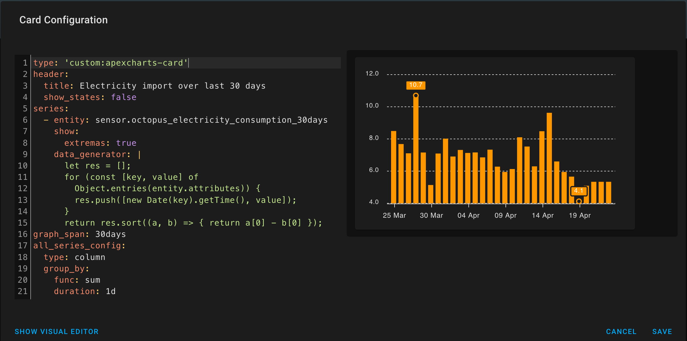

# influxdb-query-to-sensor

Python script to query an InfluxDB database and create a Home Assistant sensor with the results in the sensor's attributes as `key: value` pairs.

## Installation

1. Install the HACS custom integration [Pyscript custom component](https://github.com/custom-components/pyscript#installation).

    For example: HACS → Integrations → `+ EXPLORE & ADD REPOSITORIES` → search for pyscript and install it.

2. Install Home Assistant integration for Pyscript, and enable Pyscript to resolve dependencies. For details see [Configuration](https://hacs-pyscript.readthedocs.io/en/latest/configuration.html).

    For example: Configuration → Integrations → `+ ADD INTEGRATION` → search for `Pyscript Python scripting` → `Allow all imports` → Submit.

3. Restart Home Assistant.

4. Create the folder `config/pyscript/apps/influxdb_query_to_sensor/` and copy the script [__init__.py](__init__.py) into it.

    For example, in Terminal enter:

    ```shell
    mkdir -p /config/pyscript/apps/influxdb_query_to_sensor/ && cd $_

    git clone https://github.com/markcocker/influxdb-query-to-sensor.git __init__.py
    ```

5. Add the `influxdb_query_to_sensor` application entry and configuration into the `apps` section of the [Pyscript configuration](https://hacs-pyscript.readthedocs.io/en/latest/reference.html#configuration).

    For example, in `/config/configuration.yaml` add:

    ```yaml
    pyscript: !include pyscript.yaml
    ```

    And in `/config/pyscript.yaml` configure your InfluxDB endpoint host, port, username and password. Not shown here, but it is best practice to store usernames and passwords in a separate secrets.yaml file.

    ```yaml
    allow_all_imports: true
    apps:
      influxdb_query_to_sensor:
        host: a0d7b954-influxdb
        port: 8086
        username: homeassistant
        password: XYZ
    ```

## Syntax for service influxdb_query_to_sensor

With the above installation complete, you can now call the script via the Home Assistant service `influxdb_query_to_sensor`. The service accepts the following service data.

| Parameter | Type | Required? | Default | Description |
| --- | --- | --- | --- | --- |
| <a name="database">`database`</a> | string | ✅ | | InfluxDB database name|
| `query` | string | ✅ | | InfluxDB query. The query should return at least the two fields specified by key_field_name and value_field_name. The field `time` is always returned so typically `query` will only specify one field. For each point in the result, a sensor attribute will be added to the sensor, so be careful not to return too many (100s) of points. Test the query in the InfluxDB web UI or command line interface |
| <a name="key_field_name">`key_field_name`</a> | string | | time | Name of the field returned by the query that will be used as the attribute key |
| <a name="value_field_name">`value_field_name`</a> | string | | sum | Name of the field returned by the query that will be used as the attribute value |
| <a name="sensor">`sensor` | string | ✅ | | Name of the Home Assistant sensor to update |
| <a name="unit_of_measurement">`unit_of_measurement`</a> | string | | | If specified, add the sensor attribute unit_of_measurement with the value |
| <a name="friendly_name">`friendly_name`</a> | string | | | If specified, add the sensor attribute friendly_name with the value |
| <a name="icon">`icon`</a> | string | | | If specified, add the sensor attribute icon with the value |

## Results

The service influxdb_query_to_sensor will:

* connect to InfluxDB and send the query
* create the sensor and remove all previous attributes
* set the sensor value to the current timesamp
* optionally set the sensor attributes unit_of_measurement, friendly_name, icon if they were specified
* for each point returned in the query, extract the fields specified by key_field_name and value_field_name and use them to add as a sensor attribute

## Example

To query InfluxDB, call the `influxdb_query_to_sensor` service and pass the query and sensor details in the service data. For example:

1. Select Developer Tools → SERVICES → Service: `Pyscript Python scripting: influxdb_query_to_sensor`

2. Select `GO TO YAML MODE`

3. In `Service data` enter the query. You will need to substitute your InfluxDB database name, query, field names, and sensor details here. Use the InfluxDB or Grafana web UIs to create and test the query:

    ```yaml
    database: octopus
    query: >-
      SELECT sum("consumption")
      FROM "electricity"
      WHERE time >= now() - 30d
      GROUP BY time(1d)
      fill(none)
    key_field_name: time
    value_field_name: sum
    sensor: sensor.octopus_electricity_consumption_30days
    unit_of_measurement: kWh
    friendly_name: Import
    icon: 'mdi:flash'
    ```

4. Click CALL SERVICE. See [Developer Tools](docs/DeveloperTools.png) screenshot.

5. Check the sensor in Developer Tools → SERVICES by clicking `STATES` and search for the name of the sensor. See [Developer Tools - States](docs/DeveloperTools-States.png) screenshot an example of the query results in the sensor.

You can now automate running the query from Configuration > Automations, Node Red and elsewhere.

## Example card using data from the sensor

Once you have the sensor being populated with the query results, you can create a chart to display the data. For example:

1. Install the Lovelace card [apexcharts-card](https://github.com/RomRider/apexcharts-card)

    For example: HACS → Frontend → `+ EXPLORE & ADD REPOSITORIES` → apexcharts-card

2. Navigate to the dashboard for the card → `Edit Dashboard` → `+ ADD CARD` → `Manual`. Enter the card configuration. In the following example note the [data_generator option](https://github.com/RomRider/apexcharts-card#data_generator-option) that iterates over the sensor attributes to use all `timestamp: value` entries as data for the series:

    ```yaml
    type: 'custom:apexcharts-card'
    header:
    title: Electricity import over last 30 days
    show_states: false
    series:
    - entity: sensor.octopus_electricity_consumption_30days
        show:
        extremas: true
        data_generator: |
        let res = [];
        for (const [key, value] of Object.entries(entity.attributes)) {
            let d = new Date(key).getTime();
            if (d > 0)
               res.push([d, value]);
        }
        return res.sort((a, b) => { return a[0] - b[0] });
    graph_span: 30days
    all_series_config:
    type: column
    group_by:
        func: sum
        duration: 1d
    ```

3. The graph can be seen in the following screenshot. 

## Feedback

Please use GitHub issues to raise questions, and suggestions. Good luck.

## License

[Apache License, Version 2.0, January 2004](LICENSE)